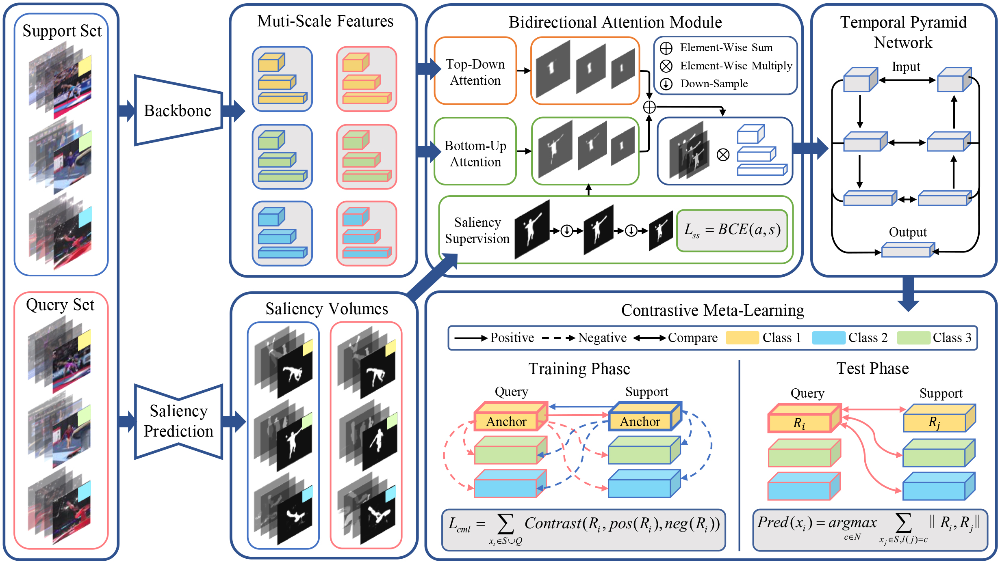
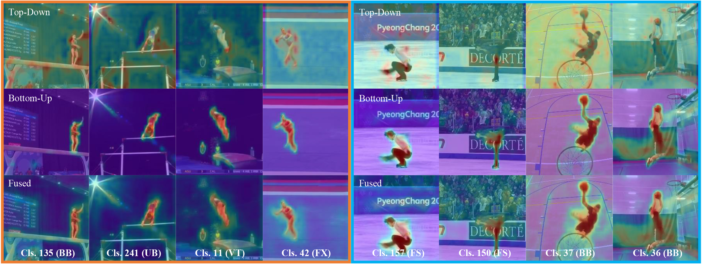
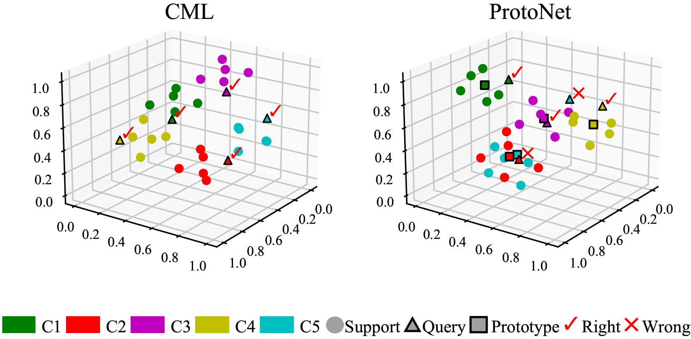

# Few-Shot Fine-Grained Action Recognition via Bidirectional Attention and Contrastive Meta-Learning

Official repository of ACM MM 2021 paper "_Few-Shot Fine-Grained Action Recognition via Bidirectional Attention and Contrastive Meta-Learning_"

Fine-grained action recognition is attracting increasing attention due to the emerging demand of specific action understanding in real-world applications, whereas the data of rare fine-grained categories is very limited.
Therefore, we propose the few-shot fine-grained action recognition problem, aiming to recognize novel fine-grained actions with only few samples given for each class. 
Although progress has been made in coarse-grained actions, existing few-shot recognition methods encounter two issues handling fine-grained actions: the inability to capture subtle action details and the inadequacy in learning from data with low inter-class variance. 
To tackle the first issue, a human vision inspired bidirectional attention module (BAM) is proposed. Combining top-down task-driven signals with bottom-up salient stimuli, BAM captures subtle action details by accurately highlighting informative spatio-temporal regions. 
To address the second issue, we introduce contrastive meta-learning (CML). Compared with the widely adopted ProtoNet-based method, CML generates more discriminative video representations for low inter-class variance data, since it makes full use of potential contrastive pairs in each training episode. 
Furthermore, to fairly compare different models, we establish specific benchmark protocols on two large-scale fine-grained action recognition datasets. 
Extensive experiments show that our method consistently achieves state-of-the-art performance across evaluated tasks.

Overview of our framework

Visualization of attention maps generated by our bidirectional attention module (BAM)

Comparision of video representations generated by ProtoNet and the proposed 
contrastive meta-learning (CML)


## Download Data

The evaluations are performed on two publicly released fine-grained action 
recognition datasets: _FineGym_ and _HAA500_.

### FineGym

Please visit the official site of [FineGym](https://sdolivia.github.io/FineGym/) to 
download data and extract frames for video clips with _Gym99_ and _Gym288_ annotations.

### HAA500

Please visit the official site of [HAA500](https://www.cse.ust.hk/haa/) and download
the 1.1 version of the dataset. Directly extract frames for each video since they are
already trimmed.

## Few-Shot Learning Protocols

You can find the split files of our few-shot fine-grained action 
recognition benchmarks [here](/benchmarks).
The specific training/test protocols of _Gym99_, _Gym288_ and _HAA500_ are introduced 
in Sec. 4.1 of our paper.

For each benchmark, "_test_class.txt_" and "_train_class.txt_" contain the labels 
of training/test categories. "_train_split.txt_" and "_test_split.txt_" contain the 
annotations for dataloaders in 
[TPN](https://github.com/decisionforce/TPN/blob/master/data/README.md) 
style, i.e. each line is a record of a video 
sample in the form of: _directory path of a video_, _total frame number_, 
_groundtruth label_.

If you find this repository useful, please cite:

```
@inproceedings{wang2021few-shot,
  title={Few-shot fine-grained action recognition via bidirectional attention and contrastive meta-learning},
  author={Wang, Jiahao and Wang, Yunhong and Liu, Sheng and Li, Annan},
  booktitle={Proceedings of the 29th ACM International Conference on Multimedia},
  year={2021}
}
```